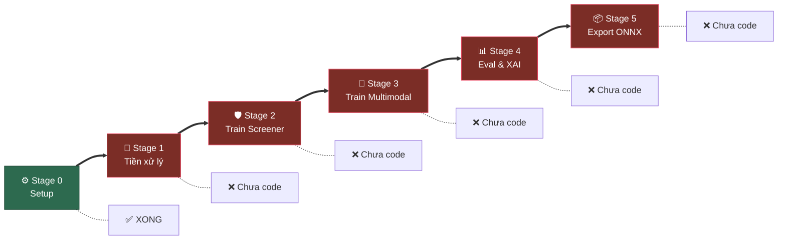
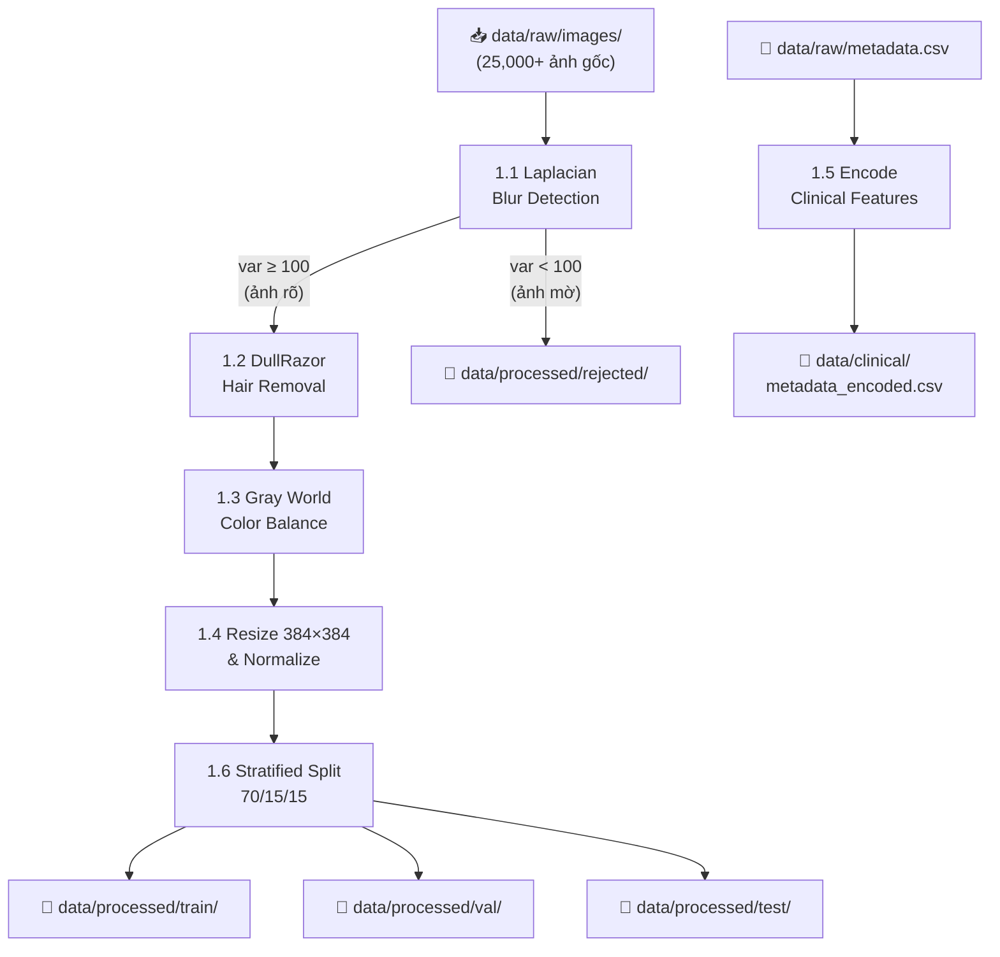
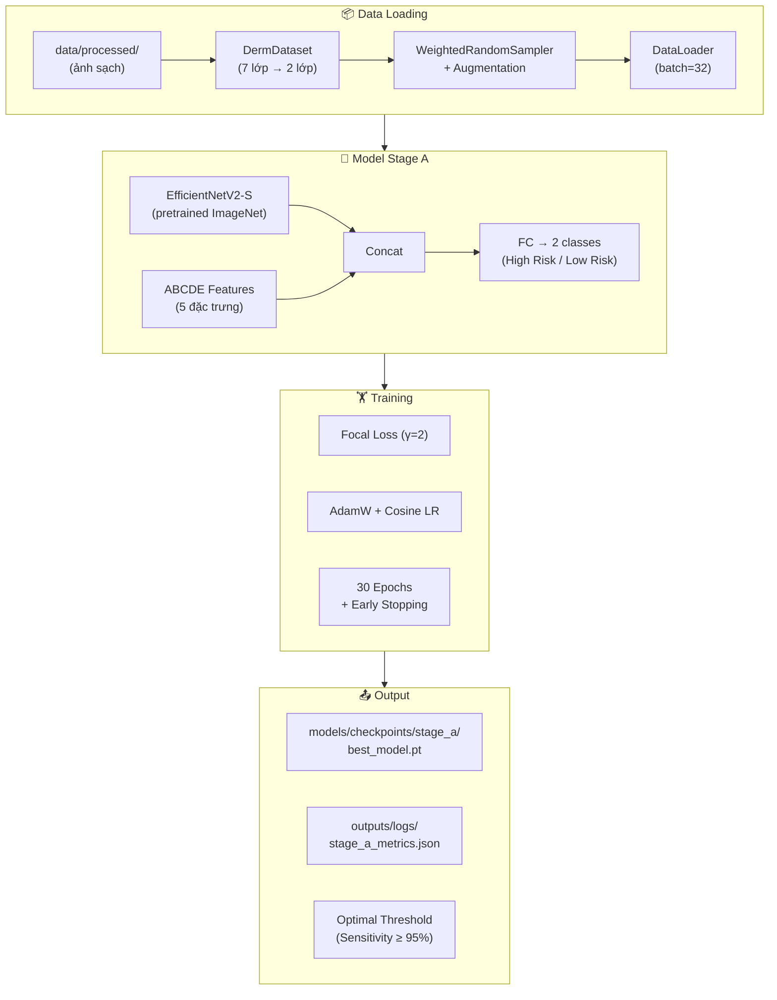
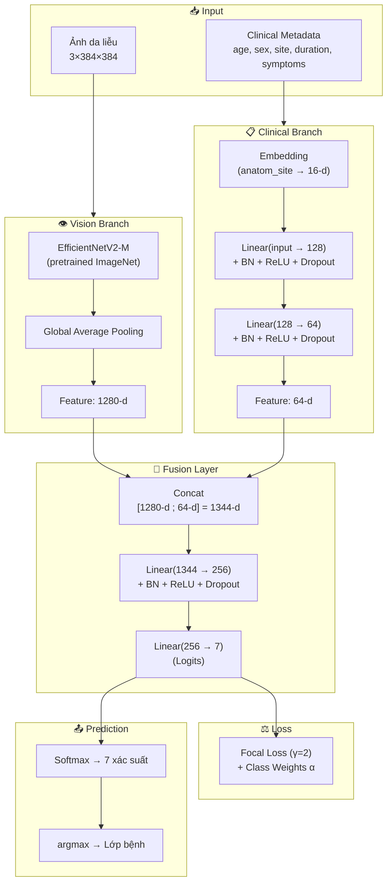
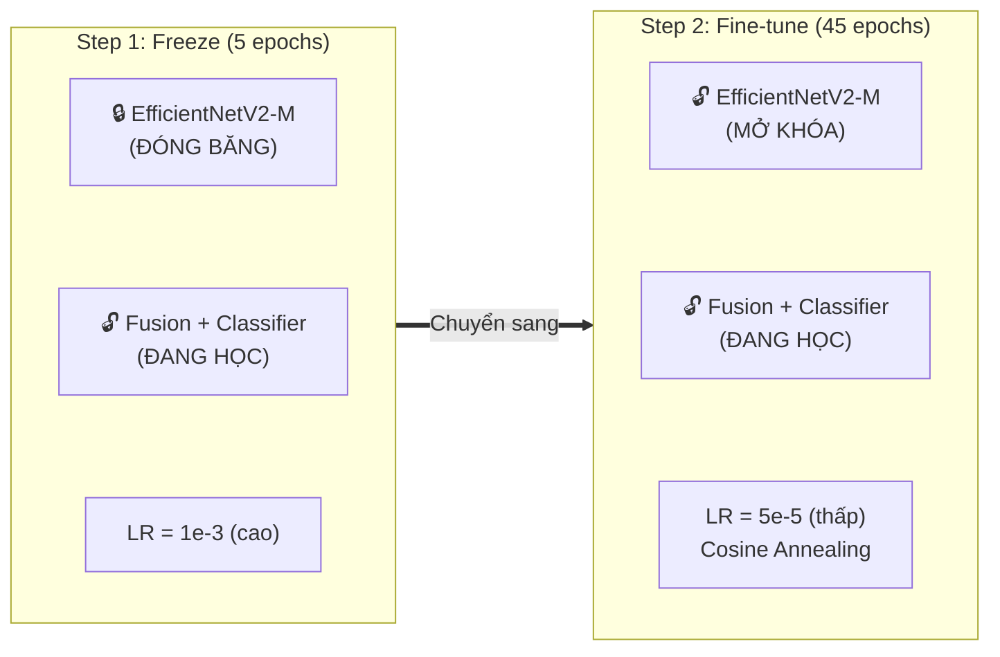
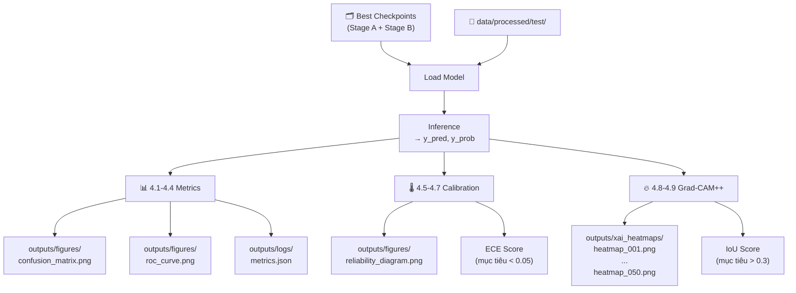
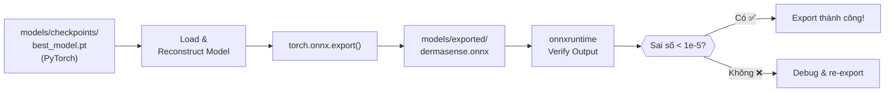

# 📌 Chi tiết Tất cả Giai đoạn — DermaSense AI

---

## Sơ đồ Tổng thể



---

---

# ⚙️ STAGE 0 — Setup & Kiểm tra Môi trường

### Mục tiêu
Thiết lập cấu trúc dự án, cài đặt thư viện, xác nhận môi trường chạy được.

### Trạng thái: ✅ ĐÃ HOÀN TẤT

---

### Danh sách Công việc

| # | Công việc | Nghiệp vụ / Tại sao làm | Trạng thái |
|---|---|---|---|
| 0.1 | Tạo cấu trúc thư mục | Phân tách rõ ràng: code (`src/`), data (`data/`), config (`configs/`), output (`outputs/`). Giúp team dễ navigate, không lẫn lộn file | ✅ |
| 0.2 | Viết `requirements.txt` | Liệt kê chính xác thư viện + version. Ai clone repo về đều cài được cùng môi trường → reproducible | ✅ |
| 0.3 | Cài đặt dependencies | `pip install -r requirements.txt` — PyTorch, timm, OpenCV, albumentations... | ✅ |
| 0.4 | Viết 5 file config YAML | **Không hardcode** tham số trong Python. Mọi ngưỡng, hyperparameter đều nằm trong YAML → dễ thay đổi thí nghiệm mà không sửa code | ✅ |
| 0.5 | Viết `check_gpu.py` | Xác nhận Python, PyTorch, CUDA, dependencies, cấu trúc thư mục đều OK trước khi bắt đầu | ✅ |
| 0.6 | Viết `.gitignore` | Chặn commit file nặng (data, model weights) lên Git. Chỉ commit code + config | ✅ |
| 0.7 | Viết `dvc.yaml` | Định nghĩa DVC pipeline để **tái tạo** toàn bộ thí nghiệm bằng 1 lệnh `dvc repro` | ✅ |
| 0.8 | Viết `src/utils/` (logger, seed, metrics) | Tiện ích nền tảng: ghi log, cố định seed, tính metrics. Dùng xuyên suốt dự án | ✅ |

### File liên quan
```
.gitignore, requirements.txt, dvc.yaml, check_gpu.py
configs/base_config.yaml
configs/stage1_preprocessing.yaml
configs/stage2_balancing.yaml
configs/stage3_train_multimodal.yaml
configs/stage4_xai_eval.yaml
src/utils/logger.py, seed.py, metrics.py
```

### Lệnh chạy kiểm tra
```bash
pip install -r requirements.txt
python check_gpu.py
```

### Tiêu chí hoàn thành
- [x] `check_gpu.py` hiển thị tất cả ✅ (trừ GPU trên local)
- [x] Import `src.utils` không lỗi

---

---

# 🧹 STAGE 1 — Tiền xử lý Dữ liệu

### Mục tiêu
Biến ảnh da liễu **thô, bẩn** (lông, mờ, lệch màu) thành ảnh **sạch, chuẩn** sẵn sàng cho huấn luyện.

### Trạng thái: ❌ CHƯA CÓ CODE

---

### Danh sách Công việc

| # | Công việc | Nghiệp vụ / Tại sao làm | File |
|---|---|---|---|
| 1.1 | **Phát hiện ảnh mờ (Blur Detection)** | Ảnh mờ = chất lượng kém → mô hình học được feature sai. Dùng **Laplacian Variance**: tính đạo hàm bậc 2, phương sai thấp (< 100) = ảnh mờ. Gắn cờ hoặc loại ra để review | `preprocessing.py` |
| 1.2 | **Xóa lông (Hair Removal)** | Lông che phủ tổn thương → mô hình nhìn thấy lông thay vì bệnh. Thuật toán **DullRazor**: (1) Blackhat morphology phát hiện cấu trúc tối nhỏ (lông) trên nền sáng (da), (2) Threshold tạo mask lông, (3) Inpainting "vá" lại bằng pixel xung quanh | `preprocessing.py` |
| 1.3 | **Cân bằng màu (Color Balance)** | Ảnh chụp từ thiết bị khác nhau → tông màu khác nhau (vàng/xanh). **Gray World** giả thuyết trung bình tất cả pixel nên là xám → cân bằng lại kênh R,G,B. Đảm bảo model nhìn thấy **màu bệnh lý** chứ không phải màu đèn | `preprocessing.py` |
| 1.4 | **Resize & Normalize** | EfficientNetV2-M yêu cầu input 384×384. Normalize theo ImageNet stats (mean/std) vì backbone pretrain trên ImageNet → cần cùng phân phối dữ liệu | `preprocessing.py` |
| 1.5 | **Encode metadata lâm sàng** | Chuyển CSV metadata (age, sex, site...) từ text → số: age → StandardScaler, sex → 0/1, anatom_site → LabelEncode. Model chỉ đọc được số | `preprocessing.py` |
| 1.6 | **Chia train/val/test** | Chia 70/15/15 **stratified** (giữ tỷ lệ 7 lớp bệnh trong mỗi tập). Nếu chia random, có thể tập test không có DF (chỉ 200 ảnh) → đánh giá sai | `run_stage1_preprocess.py` |
| 1.7 | **Lưu ảnh bị loại** | Ảnh mờ/lỗi không xóa mà lưu vào `rejected/` → có thể review lại, đảm bảo không loại nhầm ảnh tốt | `run_stage1_preprocess.py` |
| 1.8 | **Log thống kê** | Ghi lại: tổng ảnh xử lý, số ảnh bị loại, phân bố per-class, thời gian xử lý. Để biết dữ liệu sau xử lý còn bao nhiêu | `run_stage1_preprocess.py` |

### Sơ đồ Luồng



### Đầu vào → Đầu ra

| Đầu vào | Đầu ra |
|---|---|
| `data/raw/images/` (ảnh gốc) | `data/processed/train/`, `val/`, `test/` (ảnh sạch) |
| `data/raw/metadata.csv` | `data/clinical/metadata_encoded.csv` |
| `configs/stage1_preprocessing.yaml` | `data/processed/rejected/` (ảnh bị loại) |

### Lệnh chạy
```bash
python -m src.pipelines.run_stage1_preprocess
```

### Tiêu chí hoàn thành
- [ ] Ảnh trong `data/processed/` đều sạch (không lông, không mờ, đúng size 384×384)
- [ ] `metadata_encoded.csv` chứa cột số (không còn text)
- [ ] Train/val/test giữ tỷ lệ 7 lớp tương đương dataset gốc
- [ ] Log hiển thị thống kê đầy đủ

---

---

# 🛡️ STAGE 2 — Huấn luyện Safety Screener (Binary Classification)

### Mục tiêu
Xây dựng bộ **sàng lọc nhanh** phân loại: **"Cần chú ý" (High Risk)** vs **"Lành tính" (Low Risk)**.

### Tại sao cần Stage riêng?
> Trong y khoa, **bước sàng lọc** luôn đi trước bước chẩn đoán chi tiết. Tương tự bác sĩ tổng quát → bác sĩ chuyên khoa. Stage này đảm bảo **KHÔNG BỎ SÓT** ca nguy hiểm (Sensitivity ≥ 95%) — chấp nhận báo nhầm (False Positive) nhưng KHÔNG được bỏ sót (False Negative).

### Trạng thái: ❌ CHƯA CÓ CODE

---

### Phân nhóm nhị phân

| Nhóm | Lớp bệnh | Ý nghĩa |
|---|---|---|
| **High Risk** ⚠️ | MEL (Melanoma), BCC (Basal Cell Carcinoma), AK (Actinic Keratosis) | Cần khám bác sĩ chuyên khoa ngay |
| **Low Risk** ✅ | NV (Nevus), BKL (Benign Keratosis), DF (Dermatofibroma), VASC (Vascular Lesion) | Lành tính, theo dõi định kỳ |

### Danh sách Công việc

| # | Công việc | Nghiệp vụ / Tại sao làm | File |
|---|---|---|---|
| 2.1 | **Tạo Dataset nhị phân** | Map 7 lớp → 2 lớp (high/low risk) theo bảng trên. Dùng `DermDataset` với label mới | `dataset.py` |
| 2.2 | **Cấu hình WeightedRandomSampler** | High Risk chỉ chiếm ~30% dataset → cần sampler cân bằng để model không bị bias về Low Risk | `samplers.py` |
| 2.3 | **Áp dụng Augmentation** | Flip, Rotate, ColorJitter cho train. KHÔNG augment cho val/test | `augmentations.py` |
| 2.4 | **Khởi tạo model Stage A** | EfficientNetV2-**S** (nhẹ, nhanh) + ABCDE fusion head (5 features: Asymmetry, Border, Color, Diameter, Evolution) → 2 classes | `vision_branch.py` |
| 2.5 | **Cấu hình Focal Loss** | Focal Loss γ=2 + class weight α tự tính. Giảm loss cho mẫu dễ, tăng cho mẫu khó | `loss.py` |
| 2.6 | **Training loop** | AdamW optimizer, Cosine scheduler, warmup 3 epochs, early stopping patience 7 | `run_stage2_train_screener.py` |
| 2.7 | **Tối ưu threshold** | Không dùng threshold mặc định 0.5. Tìm threshold tối ưu sao cho **Sensitivity ≥ 95%** và **NPV ≥ 97%** trên validation set | `run_stage2_train_screener.py` |
| 2.8 | **Lưu checkpoint + metrics** | Lưu model tốt nhất (theo val_sensitivity) vào `models/checkpoints/stage_a/`. Lưu metrics JSON | `run_stage2_train_screener.py` |

### Sơ đồ Luồng



### Đầu vào → Đầu ra

| Đầu vào | Đầu ra |
|---|---|
| `data/processed/train/`, `val/` | `models/checkpoints/stage_a/best_model.pt` |
| `configs/stage3_train_multimodal.yaml` (section `stage_a`) | `outputs/logs/stage_a_metrics.json` |
| `configs/stage2_balancing.yaml` | Optimal threshold cho binary classification |

### Lệnh chạy
```bash
python -m src.pipelines.run_stage2_train_screener
```

### Tiêu chí hoàn thành
- [ ] **Sensitivity ≥ 95%** (không bỏ sót > 5% ca nguy hiểm)
- [ ] **NPV ≥ 97%** (khi nói "lành tính" thì đúng ≥ 97%)
- [ ] Checkpoint `best_model.pt` được lưu
- [ ] Metrics JSON ghi đầy đủ Sensitivity, Specificity, NPV, AUC-ROC

---

---

# 🧠 STAGE 3 — Huấn luyện Multimodal 7-class Classifier

### Mục tiêu
Xây dựng mô hình **phân loại chi tiết 7 loại tổn thương da** bằng cách kết hợp **ảnh dermoscopy + metadata lâm sàng**.

### Tại sao kết hợp Multimodal?
> Bác sĩ da liễu không chỉ nhìn ảnh — họ hỏi tuổi, giới tính, vị trí tổn thương, thời gian xuất hiện, triệu chứng. Nghiên cứu cho thấy kết hợp clinical metadata **tăng AUC-ROC 2-5%** so với chỉ dùng ảnh.

### Trạng thái: ❌ CHƯA CÓ CODE

---

### 7 Lớp bệnh

| Mã | Tên đầy đủ | Mức nguy cơ | Tỷ lệ trong dataset |
|---|---|---|---|
| MEL | Melanoma | 🔴 Cao | ~8% |
| BCC | Basal Cell Carcinoma | 🔴 Cao | ~5% |
| AK | Actinic Keratosis | 🟡 Trung bình | ~4% |
| NV | Melanocytic Nevus | 🟢 Thấp | ~55% (đa số) |
| BKL | Benign Keratosis | 🟢 Thấp | ~14% |
| DF | Dermatofibroma | 🟢 Thấp | ~1.5% (rất hiếm) |
| VASC | Vascular Lesion | 🟢 Thấp | ~2% |

### Danh sách Công việc

| # | Công việc | Nghiệp vụ / Tại sao làm | File |
|---|---|---|---|
| 3.1 | **Tạo Multimodal Dataset** | `DermDataset` trả về `(image_tensor, clinical_tensor, label)`. Image = ảnh 3×384×384. Clinical = vector số (age, sex, site, duration, symptoms). Label = 0-6 | `dataset.py` |
| 3.2 | **Augmentation nâng cao cho lớp thiểu số** | Lớp MEL, BCC, AK, DF: augmentation mạnh hơn (ElasticTransform, GridDistortion, CutMix). Lớp NV: augmentation cơ bản. **Tại sao**: lớp hiếm cần nhiều biến thể hơn để model học được đặc trưng | `augmentations.py` |
| 3.3 | **WeightedRandomSampler** | Chiến lược `effective_num` (paper CVPR 2019): tính "số mẫu hiệu quả" thay vì đếm thô. Hiệu quả nhất cho phân phối long-tail như dataset da liễu | `samplers.py` |
| 3.4 | **Xây dựng Vision Branch** | EfficientNetV2-**M** (mạnh hơn V2-S ở Stage 2). Dùng `timm.create_model()`, bỏ head gốc, trích xuất feature 1280-d. Hỗ trợ `freeze_backbone()` / `unfreeze_backbone()` | `vision_branch.py` |
| 3.5 | **Xây dựng Clinical Branch** | MLP 3 lớp: Input → 128 → 64. Có Embedding layer cho `anatom_site` (15+ vị trí). BatchNorm + ReLU + Dropout giữa các lớp | `clinical_branch.py` |
| 3.6 | **Xây dựng Fusion Network** | Kết hợp Vision (1280-d) + Clinical (64-d) → Concat (1344-d) → FC 256 → 7 classes. Hoặc Gated Attention fusion | `fusion_net.py` |
| 3.7 | **2-Step Training** | **Step 1 (5 epochs)**: 🔒 Freeze backbone EfficientNetV2 → chỉ train Fusion + Classifier (LR=1e-3). **Tại sao**: để lớp mới học cách "đọc" features từ backbone mà không phá weights pretrained | `run_stage3_train_multimodal.py` |
| 3.8 | **2-Step Training (tiếp)** | **Step 2 (45 epochs)**: 🔓 Unfreeze toàn bộ → fine-tune end-to-end (LR=5e-5). Cosine Annealing giảm LR mượt mà. **Tại sao**: fine-tune nhẹ nhàng giúp backbone thích ứng với domain da liễu mà không quên kiến thức ImageNet | `run_stage3_train_multimodal.py` |
| 3.9 | **Early Stopping + Best Checkpoint** | Monitor `val_auc_roc_macro`. Patience = 10 epochs. Lưu model tốt nhất. **Tại sao**: ngăn overfitting — model train quá lâu sẽ "học thuộc" tập train mà không generalize tốt | `run_stage3_train_multimodal.py` |
| 3.10 | **W&B Logging** | Log loss, accuracy, AUC, learning rate mỗi epoch lên Weights & Biases. **Tại sao**: theo dõi trực quan, so sánh nhiều thí nghiệm, chia sẻ kết quả với team | `run_stage3_train_multimodal.py` |
| 3.11 | **Train Baselines** | Train thêm ResNet50 (vision-only) và EfficientNetV2-M (vision-only, không clinical) để **so sánh**. Chứng minh Multimodal tốt hơn Single-modal | `run_stage3_train_multimodal.py` |

### Sơ đồ Kiến trúc Mô hình



### Chiến lược 2-Step Training



> **Tại sao 2 bước?** Nếu unfreeze ngay từ đầu, gradient từ lớp Fusion/Classifier (chưa học gì, loss rất lớn) sẽ lan ngược và **phá hỏng** weights pretrained của backbone. Step 1 cho lớp mới "ổn định" trước, Step 2 mới fine-tune nhẹ nhàng.

### Đầu vào → Đầu ra

| Đầu vào | Đầu ra |
|---|---|
| `data/processed/train/`, `val/` | `models/checkpoints/stage_b/best_model.pt` |
| `data/clinical/metadata_encoded.csv` | `outputs/logs/stage_b_metrics.json` |
| `configs/stage3_train_multimodal.yaml` | W&B dashboard (online) |
| `configs/stage2_balancing.yaml` | |

### Lệnh chạy
```bash
python -m src.pipelines.run_stage3_train_multimodal
```

### Tiêu chí hoàn thành
- [ ] **AUC-ROC Macro ≥ 0.90** trên validation set
- [ ] **Balanced Accuracy ≥ 0.80**
- [ ] Multimodal (ảnh + clinical) **tốt hơn** vision-only baseline
- [ ] Training curves hội tụ, không overfitting
- [ ] Checkpoint `best_model.pt` được lưu

---

---

# 📊 STAGE 4 — Đánh giá & Giải thích Mô hình (XAI)

### Mục tiêu
Đánh giá **toàn diện** chất lượng mô hình trên test set + **giải thích** tại sao model đưa ra quyết định (bắt buộc trong AI y khoa).

### Tại sao cần XAI?
> AI y khoa KHÔNG được phép là "hộp đen". FDA (Mỹ), EU AI Act yêu cầu mô hình phải **giải thích được**. Bác sĩ cần biết: "AI nhìn vào vùng nào trên ảnh để kết luận đây là melanoma?" Nếu AI chỉ đúng vào tổn thương → đáng tin. Nếu chỉ vào vùng da bình thường → AI sai.

### Trạng thái: ❌ CHƯA CÓ CODE

---

### Danh sách Công việc

| # | Công việc | Nghiệp vụ / Tại sao làm | File |
|---|---|---|---|
| **Metrics** ||||
| 4.1 | **Tính metrics tổng thể** | AUC-ROC macro (khả năng phân biệt), Balanced Accuracy (công bằng giữa các lớp), F1-weighted, Cohen's Kappa (mức đồng thuận) | `metrics.py` |
| 4.2 | **Tính Sensitivity / Specificity per-class** | Sensitivity (recall) từng lớp: MEL phải ≥ 90% (không bỏ sót melanoma). Specificity: tỷ lệ "nói không bệnh thì đúng" | `metrics.py` |
| 4.3 | **Vẽ Confusion Matrix** | Ma trận nhầm lẫn: hàng = nhãn thật, cột = nhãn dự đoán. Nhìn nhanh model nhầm lớp nào với lớp nào (VD: AK thường bị nhầm với BKL) | `metrics.py` → `run_stage4_eval_xai.py` |
| 4.4 | **Vẽ ROC Curves** | 1 đường ROC cho mỗi lớp bệnh. AUC = diện tích dưới đường cong. AUC = 1.0 = hoàn hảo, AUC = 0.5 = random | `metrics.py` → `run_stage4_eval_xai.py` |
| **Calibration** ||||
| 4.5 | **Temperature Scaling** | Học 1 tham số T trên validation set. Logits_mới = Logits / T. Làm "nguội" xác suất để model tự tin đúng mức. **Y khoa**: nếu model nói "90% melanoma" thì thực tế phải đúng ~90%. Nếu không calibrate, model có thể nói 90% nhưng chỉ đúng 60% | `calibration.py` |
| 4.6 | **Tính ECE** | Expected Calibration Error — trung bình sai lệch giữa confidence và accuracy. **Mục tiêu: ECE < 0.05** | `calibration.py` |
| 4.7 | **Vẽ Reliability Diagram** | Biểu đồ bar: x = confidence (0-100%), y = accuracy thực tế. Đường chéo = hoàn hảo. Bar cao hơn = overconfident | `calibration.py` |
| **Explainable AI** ||||
| 4.8 | **Sinh Grad-CAM++ Heatmaps** | Hook vào last conv layer → tính gradient-weighted activation → tạo heatmap nhiệt. Vùng đỏ = model chú ý cao. Overlay lên ảnh gốc. Sinh 50 ảnh mẫu cho báo cáo | `gradcam.py` |
| 4.9 | **Tính IoU Grad-CAM++ vs Mask** | So sánh vùng heatmap (threshold) với segmentation mask thật → IoU score. Đo **khách quan** model có "nhìn đúng chỗ" không | `iou_evaluator.py` |

### Sơ đồ Luồng



### Đầu vào → Đầu ra

| Đầu vào | Đầu ra |
|---|---|
| `models/checkpoints/stage_a/` + `stage_b/` | `outputs/figures/confusion_matrix.png` |
| `data/processed/test/` | `outputs/figures/roc_curve.png` |
| `data/clinical/metadata_encoded.csv` | `outputs/figures/reliability_diagram.png` |
| `configs/stage4_xai_eval.yaml` | `outputs/xai_heatmaps/heatmap_*.png` |
| | `outputs/logs/stage_b_metrics.json` |

### Lệnh chạy
```bash
python -m src.pipelines.run_stage4_eval_xai
```

### Tiêu chí hoàn thành
- [ ] Metrics JSON đầy đủ (AUC, Sensitivity, Specificity, F1, Kappa, NPV)
- [ ] Confusion Matrix cho thấy model phân loại đúng đa số
- [ ] **ECE < 0.05** sau Temperature Scaling
- [ ] Heatmaps Grad-CAM++ "nhìn vào" đúng vùng tổn thương (kiểm tra bằng mắt + IoU)
- [ ] Tất cả biểu đồ lưu vào `outputs/figures/`

---

---

# 📦 STAGE 5 — Export ONNX

### Mục tiêu
Chuyển đổi mô hình PyTorch sang **định dạng ONNX** để triển khai (deploy) trên các nền tảng production.

### Tại sao cần Export?
> PyTorch yêu cầu Python runtime → nặng, chậm cho production. ONNX là định dạng **universal** — chạy được trên mobile (Android/iOS), web (ONNX.js), server (ONNX Runtime), edge device mà KHÔNG cần PyTorch. Inference nhanh hơn 2-5× nhờ tối ưu hóa đồ thị tính toán.

### Trạng thái: ❌ CHƯA CÓ CODE

---

### Danh sách Công việc

| # | Công việc | Nghiệp vụ / Tại sao làm | File |
|---|---|---|---|
| 5.1 | **Load best checkpoint** | Load `best_model.pt` → khởi tạo `MultimodalFusionNet` với weights đã train | `run_stage5_export_onnx.py` |
| 5.2 | **Tạo dummy input** | Tạo tensor giả: image (1, 3, 384, 384) + clinical (1, num_features). ONNX cần input mẫu để trace computation graph | `run_stage5_export_onnx.py` |
| 5.3 | **Export ONNX** | `torch.onnx.export(model, dummy_input, output_path, opset_version=17, dynamic_axes=...)`. Dynamic axes cho phép batch size linh hoạt | `run_stage5_export_onnx.py` |
| 5.4 | **Verify consistency** | Load model ONNX bằng `onnxruntime` → chạy inference với cùng input → so sánh output với PyTorch. Sai số phải < 1e-5 (gần như giống hệt) | `run_stage5_export_onnx.py` |
| 5.5 | **Log thông tin model** | Ghi: kích thước file ONNX (MB), số parameters, thời gian inference trung bình | `run_stage5_export_onnx.py` |

### Sơ đồ Luồng



### Đầu vào → Đầu ra

| Đầu vào | Đầu ra |
|---|---|
| `models/checkpoints/stage_b/best_model.pt` | `models/exported/dermasense_stage_b.onnx` |
| `configs/stage3_train_multimodal.yaml` | Log xác nhận consistency |

### Lệnh chạy
```bash
python -m src.pipelines.run_stage5_export_onnx
```

### Tiêu chí hoàn thành
- [ ] File `.onnx` được tạo trong `models/exported/`
- [ ] ONNX Runtime load thành công, không lỗi
- [ ] Output ONNX vs PyTorch sai số < 1e-5
- [ ] File size hợp lý (< 300MB)

---

---

## 📋 Tóm tắt Toàn bộ Giai đoạn

| Stage | Mục tiêu | Input chính | Output chính | Metric mục tiêu | Trạng thái |
|---|---|---|---|---|---|
| **0** Setup | Cài đặt môi trường | — | Configs, Utils | `check_gpu.py` all ✅ | ✅ Xong |
| **1** Tiền xử lý | Ảnh thô → ảnh sạch | `data/raw/` | `data/processed/` | Ảnh sạch, không lông, đúng size | ❌ |
| **2** Train Screener | Binary: High vs Low Risk | `data/processed/` | `checkpoints/stage_a/` | Sensitivity ≥ 95%, NPV ≥ 97% | ❌ |
| **3** Train Multimodal | 7-class: Ảnh + Clinical | `data/processed/` + `clinical/` | `checkpoints/stage_b/` | AUC-ROC ≥ 0.90, BA ≥ 0.80 | ❌ |
| **4** Eval & XAI | Đánh giá + Giải thích | Checkpoints | `outputs/figures/` + `xai_heatmaps/` | ECE < 0.05, Heatmap đúng chỗ | ❌ |
| **5** Export | PyTorch → ONNX | Checkpoint | `models/exported/*.onnx` | Sai số < 1e-5 | ❌ |

### Lệnh chạy Toàn bộ Pipeline (sau khi có code)
```bash
# Chạy từng stage
python -m src.pipelines.run_stage1_preprocess
python -m src.pipelines.run_stage2_train_screener
python -m src.pipelines.run_stage3_train_multimodal
python -m src.pipelines.run_stage4_eval_xai
python -m src.pipelines.run_stage5_export_onnx

# Hoặc chạy tự động toàn bộ qua DVC
dvc repro
```
