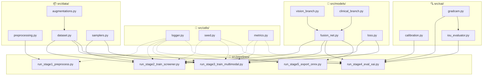

# 📋 Kế hoạch Tổng quan Nghiệp vụ — Thư mục `src/`

> Tài liệu này giải thích **mục đích, nghiệp vụ, đầu vào/đầu ra** của từng file Python trong `src/`. Mỗi file được thiết kế để giải quyết một bài toán cụ thể trong pipeline phân loại tổn thương da.

---

## Tổng quan Cấu trúc

```
src/
├── __init__.py                          # Package root
├── utils/                               # 🔧 Tiện ích dùng chung
│   ├── __init__.py
│   ├── logger.py                        # Ghi log
│   ├── seed.py                          # Cố định seed + detect device
│   └── metrics.py                       # Tính toán metrics đánh giá
│
├── data/                                # 📦 Xử lý & nạp dữ liệu
│   ├── __init__.py
│   ├── preprocessing.py                 # Tiền xử lý ảnh da liễu
│   ├── dataset.py                       # PyTorch Dataset
│   ├── augmentations.py                 # Data augmentation
│   └── samplers.py                      # Cân bằng lớp
│
├── models/                              # 🧠 Kiến trúc mạng
│   ├── __init__.py
│   ├── vision_branch.py                 # Nhánh xử lý ảnh
│   ├── clinical_branch.py               # Nhánh xử lý metadata lâm sàng
│   ├── fusion_net.py                    # Mạng kết hợp đa phương thức
│   └── loss.py                          # Hàm mất mát
│
├── xai/                                 # 🔍 Giải thích mô hình
│   ├── __init__.py
│   ├── gradcam.py                       # Grad-CAM++ heatmap
│   ├── calibration.py                   # Hiệu chuẩn xác suất
│   └── iou_evaluator.py                 # Đánh giá định lượng XAI
│
└── pipelines/                           # 🚀 Scripts chạy pipeline
    ├── __init__.py
    ├── run_stage1_preprocess.py          # Chạy tiền xử lý
    ├── run_stage2_train_screener.py      # Huấn luyện bộ sàng lọc
    ├── run_stage3_train_multimodal.py    # Huấn luyện mô hình đa phương thức
    ├── run_stage4_eval_xai.py            # Đánh giá & giải thích
    └── run_stage5_export_onnx.py         # Xuất ONNX
```

---

## Sơ đồ Phụ thuộc giữa các Module



---

## Package 1: `src/utils/` — Tiện ích dùng chung

> Chứa các hàm **không liên quan trực tiếp đến nghiệp vụ da liễu** nhưng được gọi ở khắp nơi trong dự án.

---

### 📄 [logger.py](file:///c:/DermaSense_AI/src/utils/logger.py) — Ghi log thực thi

| Thuộc tính | Mô tả |
|---|---|
| **Mục đích** | Tạo logger chuẩn cho toàn bộ pipeline, ghi ra cả console và file |
| **Tại sao cần** | Khi pipeline chạy hàng giờ (tiền xử lý 25,000 ảnh, train 50 epochs), cần log để theo dõi tiến độ, debug lỗi, và lưu lịch sử |
| **Đầu vào** | Tên module (`__name__`), thư mục log (tùy chọn) |
| **Đầu ra** | Object `logging.Logger` đã cấu hình |

**Hàm chính:**
| Hàm | Chức năng |
|---|---|
| `get_logger(name, log_dir, level)` | Tạo logger với format `timestamp | LEVEL | module | message`. Ghi ra console + file (nếu có `log_dir`) |

**Trạng thái:** ✅ Đã có code hoàn chỉnh

---

### 📄 [seed.py](file:///c:/DermaSense_AI/src/utils/seed.py) — Reproducibility & Device

| Thuộc tính | Mô tả |
|---|---|
| **Mục đích** | Cố định random seed ở mọi thư viện + tự động phát hiện GPU/CPU |
| **Tại sao cần** | Trong nghiên cứu y khoa, kết quả **phải lặp lại được** (reproducibility). Nếu train 2 lần cùng config phải ra cùng kết quả. Seed cố định đảm bảo điều này |
| **Đầu vào** | Giá trị seed (mặc định 42), preference device |
| **Đầu ra** | Seed được set toàn cục; `torch.device` object |

**Hàm chính:**
| Hàm | Chức năng |
|---|---|
| `set_seed(seed=42)` | Set seed cho `random`, `numpy`, `torch`, `torch.cuda`, `PYTHONHASHSEED`. Bật `cudnn.deterministic`, tắt `cudnn.benchmark` |
| `get_device(preference="auto")` | Trả `torch.device("cuda")` nếu có GPU, ngược lại `"cpu"`. Hỗ trợ ép chọn `"cuda"` hoặc `"cpu"` |

**Trạng thái:** ✅ Đã có code hoàn chỉnh

---

### 📄 [metrics.py](file:///c:/DermaSense_AI/src/utils/metrics.py) — Đo lường Hiệu suất Mô hình

| Thuộc tính | Mô tả |
|---|---|
| **Mục đích** | Tính toán tất cả metrics đánh giá chất lượng mô hình phân loại da liễu |
| **Tại sao cần** | Trong y khoa, chỉ **accuracy** là KHÔNG ĐỦ. Cần Sensitivity (không bỏ sót bệnh nguy hiểm), Specificity (không báo nhầm), NPV (khi nói "không bệnh" thì đúng bao nhiêu %), AUC-ROC (khả năng phân biệt tổng thể) |
| **Đầu vào** | Nhãn thật `y_true`, nhãn dự đoán `y_pred`, xác suất `y_prob` |
| **Đầu ra** | Dictionary chứa tất cả metrics |

**Hàm chính:**
| Hàm | Chức năng |
|---|---|
| `compute_classification_metrics()` | Tính accuracy, balanced accuracy, precision/recall/F1 (weighted), Cohen's Kappa, AUC-ROC macro |
| `compute_sensitivity_specificity()` | Tính Sensitivity, Specificity, PPV, NPV từ confusion matrix (cho bài toán nhị phân Stage A) |
| `print_classification_report()` | In báo cáo phân loại chi tiết per-class |

**Cần bổ sung:**
| Hàm | Chức năng |
|---|---|
| `compute_ece()` | Tính Expected Calibration Error — đo mức độ "tự tin đúng mức" của mô hình |
| `plot_confusion_matrix()` | Vẽ confusion matrix heatmap → lưu file PNG |
| `plot_roc_curves()` | Vẽ ROC curves cho từng lớp bệnh → lưu file PNG |
| `plot_reliability_diagram()` | Vẽ biểu đồ reliability → lưu file PNG |

**Trạng thái:** ⚠️ Có code nhưng cần bổ sung thêm hàm

---

## Package 2: `src/data/` — Xử lý & Nạp Dữ liệu

> Chứa toàn bộ logic **biến đổi dữ liệu thô thành input cho mô hình**. Đây là package quan trọng nhất vì "garbage in → garbage out".

---

### 📄 [preprocessing.py](file:///c:/DermaSense_AI/src/data/preprocessing.py) — Tiền xử lý Ảnh Da liễu

| Thuộc tính | Mô tả |
|---|---|
| **Mục đích** | Làm sạch ảnh da liễu: xóa lông, lọc ảnh mờ, cân bằng màu, resize |
| **Tại sao cần** | Ảnh da liễu gốc rất "bẩn": có lông che phủ tổn thương, chụp mờ, ánh sáng không đều (vàng/xanh do đèn phòng khám). Nếu không xử lý, mô hình sẽ học nhầm các đặc trưng nhiễu thay vì đặc trưng bệnh |
| **Đầu vào** | Ảnh BGR (OpenCV), config YAML (ngưỡng, tham số) |
| **Đầu ra** | Ảnh đã làm sạch (BGR), cờ chất lượng (blur/not blur) |
| **Config** | `configs/stage1_preprocessing.yaml` |

**Hàm/Class chính:**
| Hàm | Thuật toán | Giải thích nghiệp vụ |
|---|---|---|
| `compute_laplacian_variance(image)` | Tính phương sai của bộ lọc Laplacian trên ảnh grayscale | Ảnh mờ có gradient thấp → phương sai Laplacian thấp. Ngưỡng < 100 → gắn cờ "ảnh mờ". Mục đích: **loại bỏ ảnh chất lượng kém** trước khi train |
| `dullrazor_hair_removal(image)` | Morphological Blackhat → Binary Threshold → Inpainting | **DullRazor** là thuật toán chuyên dụng cho da liễu (paper 1997). Blackhat phát hiện cấu trúc tối nhỏ (lông) trên nền sáng (da). Sau đó dùng OpenCV inpainting "vá" lại vùng lông bằng pixel xung quanh |
| `gray_world_balance(image)` | Cân bằng từng kênh R,G,B về giá trị trung bình chung | Giả thuyết "thế giới xám": trung bình tất cả pixel trong ảnh nên là xám trung tính. Nếu kênh xanh quá cao (do đèn huỳnh quang) → giảm xuống. **Đảm bảo màu sắc nhất quán** giữa các ảnh chụp từ các thiết bị khác nhau |
| `resize_and_normalize(image)` | Resize bilinear 384×384, normalize ImageNet stats | EfficientNetV2-M yêu cầu input 384×384. Normalize theo mean/std ImageNet vì backbone đã pretrain trên ImageNet |
| `preprocess_single_image(image_path)` | Gọi tuần tự các hàm trên | Pipeline hoàn chỉnh cho 1 ảnh |

**Trạng thái:** ❌ File rỗng — cần xây dựng

---

### 📄 [dataset.py](file:///c:/DermaSense_AI/src/data/dataset.py) — Custom PyTorch Dataset

| Thuộc tính | Mô tả |
|---|---|
| **Mục đích** | Đọc song song ảnh + metadata lâm sàng, trả về tensor chuẩn cho DataLoader |
| **Tại sao cần** | Mô hình cần **2 loại input đồng thời**: ảnh (tensor 3×384×384) và metadata lâm sàng (tuổi, giới tính, vị trí tổn thương). PyTorch yêu cầu custom Dataset để load 2 nguồn dữ liệu này song song |
| **Đầu vào** | Thư mục ảnh đã xử lý (`data/processed/train/`), file CSV metadata (`data/clinical/`) |
| **Đầu ra** | Tuple `(image_tensor, clinical_tensor, label)` |
| **Config** | `configs/base_config.yaml` (paths, labels) |

**Class chính:**
| Class/Hàm | Chức năng |
|---|---|
| `DermDataset(Dataset)` | Custom Dataset. `__getitem__` trả `(image, clinical_features, label)`. Image đã qua augmentation (nếu mode=train). Clinical features đã encode (age → StandardScaler, sex → OneHot, anatom_site → LabelEncode/Embedding) |
| `build_dataloader(split, batch_size, ...)` | Tạo `DataLoader` với `num_workers`, `pin_memory`, `sampler` tùy chọn |

**Tại sao dùng Multimodal (Ảnh + Clinical)?**
> Nghiên cứu cho thấy melanoma ở người trên 60 tuổi phổ biến hơn gấp 10 lần so với người dưới 30. Tổn thương ở lưng (khó tự quan sát) thường phát hiện muộn hơn. Kết hợp metadata lâm sàng giúp mô hình **mô phỏng tư duy bác sĩ** — bác sĩ không chỉ nhìn ảnh mà còn hỏi bệnh sử.

**Trạng thái:** ❌ File rỗng — cần xây dựng

---

### 📄 [augmentations.py](file:///c:/DermaSense_AI/src/data/augmentations.py) — Data Augmentation

| Thuộc tính | Mô tả |
|---|---|
| **Mục đích** | Tăng cường dữ liệu huấn luyện bằng các biến đổi hình ảnh |
| **Tại sao cần** | Dataset da liễu **mất cân bằng nghiêm trọng**: NV (nevus) có ~12,000 ảnh, nhưng DF (dermatofibroma) chỉ có ~200 ảnh. Augmentation tạo thêm biến thể cho lớp thiểu số, giúp mô hình không bị **bias** về lớp đa số |
| **Đầu vào** | Ảnh numpy array, mode (train/val/test) |
| **Đầu ra** | Ảnh đã augment (numpy array) |
| **Config** | `configs/stage2_balancing.yaml` (augmentation parameters) |

**Hàm chính:**
| Hàm | Các phép biến đổi | Giải thích nghiệp vụ |
|---|---|---|
| `get_train_transforms()` | HorizontalFlip, VerticalFlip, RandomRotate90, ShiftScaleRotate, ColorJitter, ElasticTransform, GridDistortion | **Train**: augmentation mạnh để mô hình "nhìn" tổn thương từ nhiều góc, nhiều ánh sáng. Elastic/Grid mô phỏng độ co giãn của da. Tổn thương da có thể xuất hiện ở bất kỳ hướng nào → flip/rotate là hợp lý |
| `get_val_transforms()` | Resize + Normalize only | **Val/Test**: KHÔNG augment — cần đánh giá trên ảnh nguyên gốc để phản ánh đúng hiệu suất thực tế |
| `cutmix_batch(images, labels, alpha)` | CutMix trên batch | Cắt một vùng từ ảnh A dán vào ảnh B, nhãn được trộn theo tỷ lệ diện tích. Giúp mô hình học **cục bộ** thay vì phụ thuộc toàn cục |

**Trạng thái:** ❌ File rỗng — cần xây dựng

---

### 📄 [samplers.py](file:///c:/DermaSense_AI/src/data/samplers.py) — Cân bằng Lớp

| Thuộc tính | Mô tả |
|---|---|
| **Mục đích** | Tạo WeightedRandomSampler để cân bằng tỷ lệ xuất hiện của mỗi lớp trong từng batch |
| **Tại sao cần** | Nếu train bình thường, mô hình sẽ "lười" — dự đoán mọi thứ là NV (lớp đa số, 60% dataset) vì vẫn đạt accuracy 60%. Sampler buộc mỗi batch phải có **tỷ lệ cân bằng** giữa các lớp → mô hình phải học phân biệt thực sự |
| **Đầu vào** | Danh sách labels của dataset, chiến lược cân bằng |
| **Đầu ra** | `WeightedRandomSampler` object cho DataLoader |
| **Config** | `configs/stage2_balancing.yaml` (strategy, beta) |

**Hàm chính:**
| Hàm | Thuật toán | Giải thích nghiệp vụ |
|---|---|---|
| `compute_class_weights(labels, strategy)` | `inverse_frequency`: w = N / (C × n_c). `sqrt_inverse`: w = √(N/n_c). `effective_num`: w = (1-β)/(1-β^n_c) | 3 chiến lược tính trọng số. `inverse_frequency` cơ bản nhất. `effective_num` (paper CVPR 2019) hiệu quả nhất cho long-tail distribution — tính "số mẫu hiệu quả" thay vì đếm thô |
| `build_weighted_sampler(dataset)` | Tạo `WeightedRandomSampler(weights, num_samples, replacement=True)` | Mỗi epoch, sampler sẽ **lấy mẫu có trọng số** — lớp hiếm (MEL, DF) được chọn thường xuyên hơn, lớp phổ biến (NV) bị giảm tần suất |

**Trạng thái:** ❌ File rỗng — cần xây dựng

---

## Package 3: `src/models/` — Kiến trúc Mạng Neural

> Chứa **kiến trúc mô hình deep learning** — trái tim của hệ thống. Thiết kế theo mô hình **Multimodal Fusion** (kết hợp đa phương thức).

---

### 📄 [vision_branch.py](file:///c:/DermaSense_AI/src/models/vision_branch.py) — Nhánh Xử lý Ảnh

| Thuộc tính | Mô tả |
|---|---|
| **Mục đích** | Trích xuất đặc trưng hình ảnh từ ảnh da liễu bằng CNN pretrained |
| **Tại sao cần** | Ảnh da liễu chứa các pattern phức tạp (cấu trúc mạng lưới, đốm sắc tố, viền bất đối xứng). CNN pretrained trên ImageNet đã biết nhận diện cạnh, texture, hình dạng → chỉ cần fine-tune cho domain da liễu |
| **Đầu vào** | Tensor ảnh `(B, 3, 384, 384)` |
| **Đầu ra** | Feature vector `(B, 1280)` — 1280 là số chiều feature của EfficientNetV2-M |
| **Config** | `configs/stage3_train_multimodal.yaml` (backbone name, drop_rate) |

**Class chính:**
| Class | Chức năng |
|---|---|
| `VisionBranch(nn.Module)` | Dùng `timm.create_model()` load backbone EfficientNetV2-S (Stage A) hoặc V2-M (Stage B). Bỏ classification head gốc (1000 classes ImageNet), chỉ giữ feature extractor. Hỗ trợ `freeze_backbone()` / `unfreeze_backbone()` cho 2-step training |

**Tại sao chọn EfficientNetV2?**
> EfficientNetV2 (Google, 2021) đạt SOTA trên ImageNet với số parameters nhỏ hơn nhiều so với ViT. Phiên bản M có 54M params, đủ mạnh để nắm bắt pattern da liễu phức tạp nhưng vẫn chạy được trên GPU T4 (16GB VRAM). Pretrained trên ImageNet → đã biết nhận diện cạnh, texture, hình dạng cơ bản.

**Trạng thái:** ❌ File rỗng — cần xây dựng

---

### 📄 [clinical_branch.py](file:///c:/DermaSense_AI/src/models/clinical_branch.py) — Nhánh Xử lý Metadata Lâm sàng

| Thuộc tính | Mô tả |
|---|---|
| **Mục đích** | Xử lý dữ liệu lâm sàng có cấu trúc (tuổi, giới tính, vị trí tổn thương, triệu chứng) |
| **Tại sao cần** | Bác sĩ da liễu không chỉ nhìn ảnh — họ hỏi: "Bao nhiêu tuổi? Vết này ở đâu? Có ngứa/chảy máu không? Xuất hiện bao lâu rồi?". Những thông tin này **rất quan trọng** cho chẩn đoán. VD: Melanoma phổ biến hơn ở nam > 60 tuổi, tổn thương ở thân mình |
| **Đầu vào** | Tensor clinical features `(B, num_features)` |
| **Đầu ra** | Feature vector `(B, 64)` |
| **Config** | `configs/stage3_train_multimodal.yaml` (hidden_dims, dropout, embedding_dim) |

**Class chính:**
| Class | Chức năng |
|---|---|
| `ClinicalBranch(nn.Module)` | MLP 3 lớp: `Input → Linear(128) → BN → ReLU → Dropout → Linear(64) → BN → ReLU → Dropout → Output(64)`. Có `nn.Embedding` riêng cho biến phân loại `anatom_site` (15+ vị trí trên cơ thể) — embedding học được biểu diễn tốt hơn one-hot |

**Các clinical features:**
| Feature | Kiểu | Xử lý | Ý nghĩa y khoa |
|---|---|---|---|
| `age` | Continuous | StandardScaler | Melanoma tăng theo tuổi |
| `sex` | Categorical | OneHot (0/1) | Nam có nguy cơ cao hơn |
| `anatom_site` | Categorical | Embedding (16-d) | Vị trí: trunk, lower/upper extremity, head/neck... |
| `duration` | Continuous | StandardScaler | Tổn thương mới xuất hiện vs lâu năm |
| `symptoms` | Multi-label | Binary (ngứa, chảy máu, đau) | Triệu chứng cảnh báo |

**Trạng thái:** ❌ File rỗng — cần xây dựng

---

### 📄 [fusion_net.py](file:///c:/DermaSense_AI/src/models/fusion_net.py) — Mạng Kết hợp Đa Phương thức

| Thuộc tính | Mô tả |
|---|---|
| **Mục đích** | Kết hợp đặc trưng ảnh (Vision) + metadata lâm sàng (Clinical) → đưa ra dự đoán cuối cùng |
| **Tại sao cần** | Đây là **thành phần cốt lõi** — nơi 2 nguồn thông tin khác nhau (ảnh + bảng số liệu) được "hợp nhất" để đưa ra quyết định chính xác hơn. Tương tự như bác sĩ nhìn ảnh dermoscopy rồi đối chiếu với bệnh sử |
| **Đầu vào** | Tensor ảnh `(B, 3, 384, 384)` + Tensor clinical `(B, num_features)` |
| **Đầu ra** | Logits `(B, num_classes)` — 2 classes (Stage A) hoặc 7 classes (Stage B) |
| **Config** | `configs/stage3_train_multimodal.yaml` (fusion method, hidden_dim, num_classes) |

**Class chính:**
| Class | Chức năng |
|---|---|
| `MultimodalFusionNet(nn.Module)` | Chứa cả `VisionBranch` + `ClinicalBranch`. Forward: ảnh → vision features (1280-d), clinical → clinical features (64-d) → **Fusion** (1344-d) → FC layers → logits |

**Phương pháp Fusion:**
| Method | Cách hoạt động | Khi nào dùng |
|---|---|---|
| `concat` | Nối trực tiếp 2 vector: `[vision_feat; clinical_feat]` → FC | Đơn giản, hiệu quả, là **mặc định** |
| `gating` | Dùng sigmoid gate: `g = σ(W·clinical)`, output = `g ⊙ vision + (1-g) ⊙ clinical` | Cho phép mô hình tự quyết định "tin ảnh hay tin metadata hơn" tùy case |

**Trạng thái:** ❌ File rỗng — cần xây dựng

---

### 📄 [loss.py](file:///c:/DermaSense_AI/src/models/loss.py) — Hàm Mất mát Focal Loss

| Thuộc tính | Mô tả |
|---|---|
| **Mục đích** | Thay thế Cross-Entropy Loss bằng Focal Loss để xử lý class imbalance |
| **Tại sao cần** | Cross-Entropy đối xử **công bằng** với mọi mẫu. Nhưng dataset da liễu mất cân bằng → mô hình nhanh chóng "học thuộc" lớp phổ biến (NV) và bỏ qua lớp hiếm (MEL, DF). Focal Loss **giảm trọng số** cho mẫu dễ (đã phân loại đúng), **tăng trọng số** cho mẫu khó (dễ nhầm) |
| **Đầu vào** | Logits `(B, C)`, labels `(B,)` |
| **Đầu ra** | Scalar loss |
| **Config** | `configs/stage2_balancing.yaml` (gamma, alpha) |

**Class chính:**
| Class | Công thức | Giải thích |
|---|---|---|
| `FocalLoss(nn.Module)` | `FL(p_t) = -α_t × (1 - p_t)^γ × log(p_t)` | `γ=2` (mặc định): mẫu dễ (p_t=0.9) bị giảm loss ×100 lần so với mẫu khó (p_t=0.1). `α` là class weight (inverse frequency) |

**Trạng thái:** ❌ File rỗng — cần xây dựng

---

## Package 4: `src/xai/` — Giải thích Mô hình (Explainable AI)

> Chứa các công cụ **giải thích tại sao mô hình đưa ra quyết định đó**. Trong y khoa, bác sĩ KHÔNG chấp nhận "hộp đen" — họ cần biết AI "nhìn vào đâu" trên ảnh.

---

### 📄 [gradcam.py](file:///c:/DermaSense_AI/src/xai/gradcam.py) — Grad-CAM++ Heatmap

| Thuộc tính | Mô tả |
|---|---|
| **Mục đích** | Tạo heatmap hiển thị vùng ảnh nào mô hình "chú ý" nhất khi đưa ra quyết định |
| **Tại sao cần** | Bác sĩ cần **kiểm chứng** AI: nếu AI nói "melanoma" nhưng heatmap chỉ vào vùng da bình thường → AI sai, không đáng tin. Nếu heatmap chỉ đúng vào tổn thương → bác sĩ tin tưởng hơn. **Yêu cầu bắt buộc** cho AI y khoa (FDA, EU AI Act) |
| **Đầu vào** | Model đã train, ảnh input, target class |
| **Đầu ra** | Heatmap array (H×W), ảnh overlay (ảnh gốc + heatmap) |
| **Config** | `configs/stage4_xai_eval.yaml` (target_layers, colormap, alpha) |

**Class/Hàm chính:**
| Class/Hàm | Thuật toán | Chức năng |
|---|---|---|
| `GradCAMPlusPlus` | Hook gradient + activation tại target layer. Tính trọng số α = ReLU(grad) / (2×grad² + Σ(A×grad³)). Heatmap = ReLU(Σ(α × A)) | Grad-CAM++ (paper 2018) cải tiến Grad-CAM gốc: tốt hơn khi có **nhiều object cùng class** trong ảnh, và tính trọng số pixel-wise thay vì global |
| `overlay_heatmap(image, heatmap)` | Resize heatmap → apply colormap (jet) → alpha blend với ảnh gốc | Tạo ảnh trực quan: vùng đỏ/vàng = mô hình chú ý cao, vùng xanh = ít chú ý |
| `generate_batch_heatmaps(model, dataloader, n)` | Lặp qua n ảnh, sinh heatmap, lưu file | Sinh hàng loạt heatmap cho báo cáo |

**Trạng thái:** ❌ File rỗng — cần xây dựng

---

### 📄 [calibration.py](file:///c:/DermaSense_AI/src/xai/calibration.py) — Hiệu chuẩn Xác suất

| Thuộc tính | Mô tả |
|---|---|
| **Mục đích** | Hiệu chuẩn xác suất đầu ra để mô hình "tự tin đúng mức" |
| **Tại sao cần** | Mô hình deep learning thường **quá tự tin** (overconfident): nói "95% là melanoma" nhưng thực tế chỉ đúng 70%. Trong y khoa, con số xác suất phải **đáng tin cậy** — bác sĩ dựa vào đó để quyết định sinh thiết hay không. Temperature Scaling hiệu chỉnh điều này |
| **Đầu vào** | Logits từ validation set, nhãn thật |
| **Đầu ra** | Tham số Temperature T, giá trị ECE |
| **Config** | `configs/stage4_xai_eval.yaml` (optimizer, max_iter, n_bins) |

**Class/Hàm chính:**
| Class/Hàm | Thuật toán | Chức năng |
|---|---|---|
| `TemperatureScaling(nn.Module)` | Học 1 tham số T > 0. Logits mới = logits / T. Tối ưu bằng LBFGS trên NLL loss | T > 1 → "làm nguội" xác suất (giảm confidence). T < 1 → "làm nóng" (tăng confidence). Thường mô hình cần T ≈ 1.5-2.5 |
| `compute_ece(probs, labels, n_bins)` | Chia predictions thành bins theo confidence. ECE = Σ(|accuracy_bin - confidence_bin| × n_bin/N) | **ECE < 0.05** là mục tiêu. Nghĩa là: khi mô hình nói "80% chắc chắn" thì trong thực tế đúng ~80% |
| `plot_reliability_diagram(probs, labels)` | Vẽ bar chart: x = confidence, y = accuracy | Đường chéo = hiệu chuẩn hoàn hảo. Bar cao hơn chéo = overconfident, thấp hơn = underconfident |

**Trạng thái:** ❌ File rỗng — cần xây dựng

---

### 📄 [iou_evaluator.py](file:///c:/DermaSense_AI/src/xai/iou_evaluator.py) — Đánh giá Định lượng XAI

| Thuộc tính | Mô tả |
|---|---|
| **Mục đích** | Đo lường **khách quan** mức độ chính xác của Grad-CAM++ bằng chỉ số IoU |
| **Tại sao cần** | Heatmap "trông đẹp" chưa chắc đã đúng. Cần so sánh **vùng mô hình chú ý** với **vùng tổn thương thực tế** (ground-truth mask) bằng con số cụ thể. IoU (Intersection over Union) là chỉ số chuẩn |
| **Đầu vào** | Heatmap từ Grad-CAM++, ground-truth segmentation mask |
| **Đầu ra** | IoU score, Precision, Recall |
| **Config** | `configs/stage4_xai_eval.yaml` (threshold) |

**Hàm chính:**
| Hàm | Chức năng |
|---|---|
| `threshold_heatmap(heatmap, threshold)` | Chuyển heatmap liên tục → binary mask (> threshold = 1, else 0) |
| `compute_iou(pred_mask, gt_mask)` | IoU = intersection / union. Đo overlap giữa vùng heatmap và vùng tổn thương thật |
| `evaluate_xai_quality(model, dataloader, masks)` | Tính IoU trung bình trên toàn bộ test set |

**Trạng thái:** ❌ File rỗng — cần xây dựng

---

## Package 5: `src/pipelines/` — Scripts Chạy Pipeline

> Chứa các **entry point** (điểm vào) để chạy từng giai đoạn qua CLI. Mỗi script đọc config YAML, khởi tạo các module cần thiết, và thực thi logic.

---

### 📄 [run_stage1_preprocess.py](file:///c:/DermaSense_AI/src/pipelines/run_stage1_preprocess.py) — Tiền xử lý Dataset

| Thuộc tính | Mô tả |
|---|---|
| **Mục đích** | Chạy pipeline tiền xử lý cho **toàn bộ** tập dữ liệu thô |
| **Gọi đến** | `preprocessing.py`, `logger.py` |
| **Đầu vào** | `data/raw/images/`, `data/raw/metadata.csv`, `configs/stage1_preprocessing.yaml` |
| **Đầu ra** | `data/processed/train/`, `data/processed/val/`, `data/processed/test/`, `data/clinical/metadata_encoded.csv` |
| **Lệnh chạy** | `python -m src.pipelines.run_stage1_preprocess` |

**Luồng thực thi:**
1. Đọc config YAML → lấy tham số (ngưỡng blur, kernel DullRazor, target size...)
2. Duyệt toàn bộ ảnh trong `data/raw/images/`
3. Mỗi ảnh: Laplacian check → DullRazor → Gray World → Resize
4. Đọc `metadata.csv` → encode clinical features → lưu `metadata_encoded.csv`
5. Chia stratified train/val/test (70/15/15) → copy ảnh vào thư mục tương ứng
6. Lưu ảnh bị loại vào `data/processed/rejected/` để review
7. Log thống kê: tổng ảnh, số ảnh mờ bị loại, phân bố per-class

**Trạng thái:** ❌ File rỗng — cần xây dựng

---

### 📄 [run_stage2_train_screener.py](file:///c:/DermaSense_AI/src/pipelines/run_stage2_train_screener.py) — Huấn luyện Safety Screener

| Thuộc tính | Mô tả |
|---|---|
| **Mục đích** | Huấn luyện mô hình sàng lọc nhị phân (Stage A): **High Risk vs Low Risk** |
| **Gọi đến** | `dataset.py`, `augmentations.py`, `samplers.py`, `vision_branch.py`, `loss.py`, `metrics.py`, `seed.py`, `logger.py` |
| **Đầu vào** | `data/processed/`, `configs/stage3_train_multimodal.yaml` (section `stage_a`) |
| **Đầu ra** | `models/checkpoints/stage_a/best_model.pt`, `outputs/logs/stage_a_metrics.json` |
| **Lệnh chạy** | `python -m src.pipelines.run_stage2_train_screener` |

**Luồng thực thi:**
1. Set seed → detect device
2. Tạo Dataset + DataLoader (với WeightedRandomSampler + augmentation)
3. Khởi tạo EfficientNetV2-S + ABCDE fusion head (2 classes)
4. Training loop: Focal Loss + AdamW + Cosine Scheduler + Warmup
5. Mỗi epoch: validate → lưu best checkpoint (theo val_sensitivity)
6. Early stopping nếu không cải thiện sau 7 epochs
7. **Yêu cầu đặc biệt**: tối ưu threshold sao cho **Sensitivity ≥ 95%, NPV ≥ 97%** — vì đây là bộ sàng lọc, KHÔNG ĐƯỢC bỏ sót melanoma

**Trạng thái:** ❌ File rỗng — cần xây dựng

---

### 📄 [run_stage3_train_multimodal.py](file:///c:/DermaSense_AI/src/pipelines/run_stage3_train_multimodal.py) — Huấn luyện Multimodal Classifier

| Thuộc tính | Mô tả |
|---|---|
| **Mục đích** | Huấn luyện mô hình phân loại 7 lớp đa phương thức (Stage B) |
| **Gọi đến** | `dataset.py`, `augmentations.py`, `samplers.py`, `fusion_net.py`, `loss.py`, `metrics.py`, `seed.py`, `logger.py` |
| **Đầu vào** | `data/processed/`, `data/clinical/`, `configs/stage3_train_multimodal.yaml` (section `stage_b`) |
| **Đầu ra** | `models/checkpoints/stage_b/best_model.pt`, `outputs/logs/stage_b_metrics.json` |
| **Lệnh chạy** | `python -m src.pipelines.run_stage3_train_multimodal` |

**Luồng thực thi:**
1. Set seed → detect device
2. Tạo Multimodal Dataset + DataLoader (ảnh + clinical features)
3. Khởi tạo `MultimodalFusionNet` (EfficientNetV2-M + Clinical MLP + Fusion)
4. **Step 1 (5 epochs)**: Freeze backbone → train chỉ fusion + classifier (LR=1e-3)
5. **Step 2 (45 epochs)**: Unfreeze toàn bộ → fine-tune end-to-end (LR=5e-5)
6. Cosine Annealing LR + Warmup 5 epochs
7. Validate mỗi epoch → lưu best checkpoint (theo val_auc_roc)
8. Early stopping patience = 10
9. Log to W&B (nếu enabled)

**Trạng thái:** ❌ File rỗng — cần xây dựng

---

### 📄 [run_stage4_eval_xai.py](file:///c:/DermaSense_AI/src/pipelines/run_stage4_eval_xai.py) — Đánh giá & Giải thích

| Thuộc tính | Mô tả |
|---|---|
| **Mục đích** | Đánh giá toàn diện mô hình trên test set + sinh heatmap Grad-CAM++ + hiệu chuẩn xác suất |
| **Gọi đến** | `fusion_net.py`, `gradcam.py`, `calibration.py`, `iou_evaluator.py`, `metrics.py`, `logger.py` |
| **Đầu vào** | `models/checkpoints/stage_a/` + `stage_b/`, `data/processed/test/`, `configs/stage4_xai_eval.yaml` |
| **Đầu ra** | `outputs/figures/` (confusion matrix, ROC curve, reliability diagram), `outputs/xai_heatmaps/` |
| **Lệnh chạy** | `python -m src.pipelines.run_stage4_eval_xai` |

**Luồng thực thi:**
1. Load best checkpoints (Stage A + Stage B)
2. Inference trên toàn bộ test set → thu thập `y_true`, `y_pred`, `y_prob`
3. Tính tất cả metrics → lưu JSON + in console
4. Vẽ Confusion Matrix → lưu PNG
5. Vẽ ROC Curves per-class → lưu PNG
6. Temperature Scaling trên validation set → tính ECE → vẽ Reliability Diagram
7. Sinh Grad-CAM++ heatmaps cho 50 ảnh mẫu → lưu PNG
8. (Tùy chọn) Tính IoU Grad-CAM++ vs ground-truth mask

**Trạng thái:** ❌ File rỗng — cần xây dựng

---

### 📄 [run_stage5_export_onnx.py](file:///c:/DermaSense_AI/src/pipelines/run_stage5_export_onnx.py) — Export ONNX

| Thuộc tính | Mô tả |
|---|---|
| **Mục đích** | Chuyển đổi mô hình PyTorch sang định dạng ONNX để deploy |
| **Tại sao cần** | ONNX là định dạng universal — có thể chạy trên bất kỳ nền tảng nào (mobile, web, server) mà không cần PyTorch. Inference nhanh hơn 2-5× nhờ ONNX Runtime optimization |
| **Gọi đến** | `fusion_net.py`, `logger.py` |
| **Đầu vào** | `models/checkpoints/stage_b/best_model.pt` |
| **Đầu ra** | `models/exported/dermasense_stage_b.onnx` |
| **Lệnh chạy** | `python -m src.pipelines.run_stage5_export_onnx` |

**Luồng thực thi:**
1. Load best checkpoint → khởi tạo model
2. Tạo dummy input (image + clinical) → `torch.onnx.export()`
3. Verify: load ONNX model bằng `onnxruntime` → so sánh output với PyTorch → đảm bảo sai số < 1e-5

**Trạng thái:** ❌ File rỗng — cần xây dựng

---

## Bảng Tóm tắt Nhanh

| File | Thuộc Package | Mục đích 1 dòng | Trạng thái |
|---|---|---|---|
| `logger.py` | utils | Ghi log ra console + file | ✅ Done |
| `seed.py` | utils | Cố định seed + detect GPU/CPU | ✅ Done |
| `metrics.py` | utils | Tính metrics y khoa (AUC, Sensitivity...) | ⚠️ Cần bổ sung |
| `preprocessing.py` | data | Xóa lông, lọc ảnh mờ, cân bằng màu | ❌ Cần viết |
| `dataset.py` | data | Load ảnh + clinical CSV → tensor | ❌ Cần viết |
| `augmentations.py` | data | Flip, rotate, CutMix, Elastic | ❌ Cần viết |
| `samplers.py` | data | WeightedRandomSampler cho class imbalance | ❌ Cần viết |
| `vision_branch.py` | models | EfficientNetV2 feature extractor | ❌ Cần viết |
| `clinical_branch.py` | models | MLP xử lý metadata lâm sàng | ❌ Cần viết |
| `fusion_net.py` | models | Kết hợp Vision + Clinical → phân loại | ❌ Cần viết |
| `loss.py` | models | Focal Loss (γ=2) cho class imbalance | ❌ Cần viết |
| `gradcam.py` | xai | Sinh heatmap giải thích quyết định AI | ❌ Cần viết |
| `calibration.py` | xai | Temperature Scaling + ECE | ❌ Cần viết |
| `iou_evaluator.py` | xai | Đo IoU heatmap vs mask thật | ❌ Cần viết |
| `run_stage1_preprocess.py` | pipelines | Chạy tiền xử lý toàn bộ dataset | ❌ Cần viết |
| `run_stage2_train_screener.py` | pipelines | Train bộ sàng lọc nhị phân | ❌ Cần viết |
| `run_stage3_train_multimodal.py` | pipelines | Train multimodal 7-class | ❌ Cần viết |
| `run_stage4_eval_xai.py` | pipelines | Đánh giá + Grad-CAM++ + ECE | ❌ Cần viết |
| `run_stage5_export_onnx.py` | pipelines | Export sang ONNX để deploy | ❌ Cần viết |

> [!IMPORTANT]
> Có **16 file cần viết mới** và **1 file cần bổ sung**. Tổng cộng ~3,000-4,000 dòng code Python. Tôi sẽ xây dựng tuần tự từ tầng thấp (utils → data → models → xai → pipelines) để đảm bảo mỗi tầng trên đều có thể import tầng dưới mà không lỗi.
