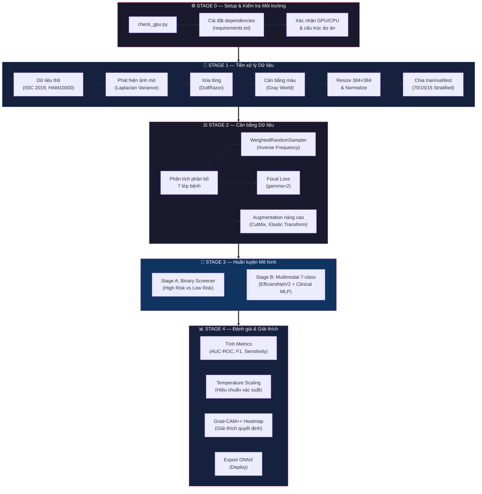
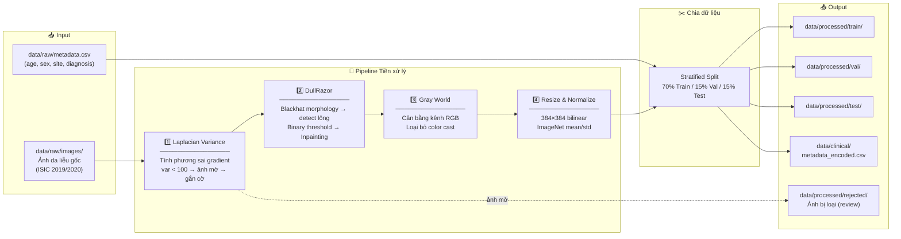
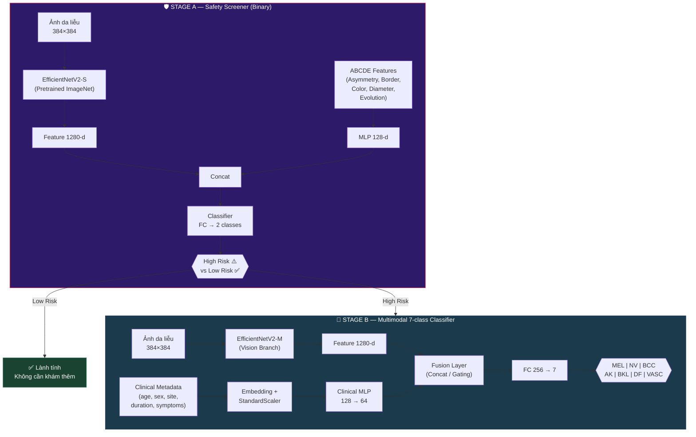
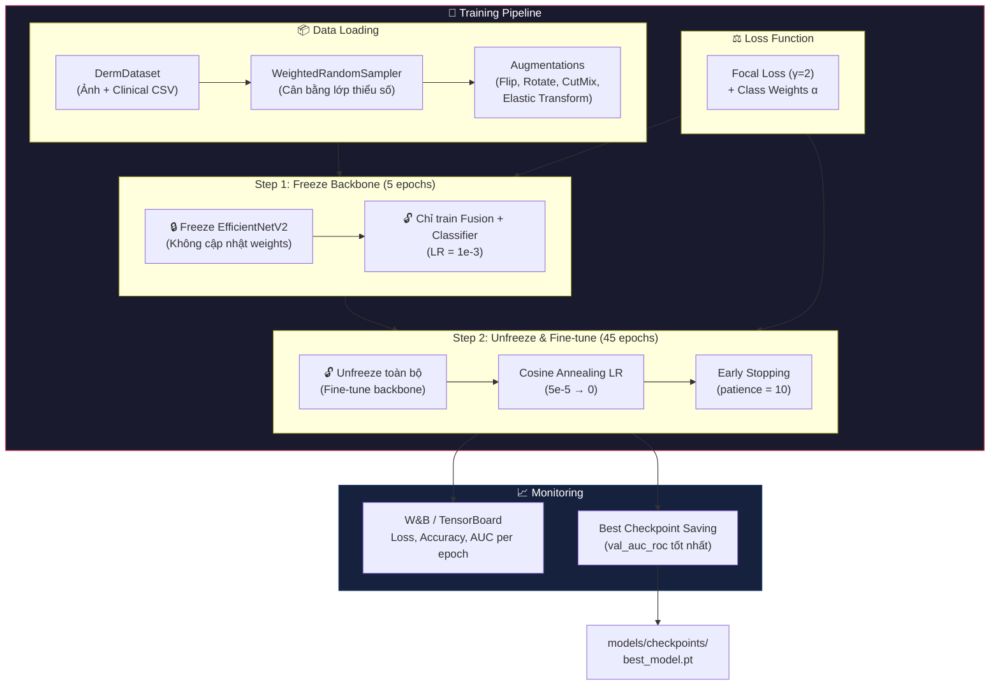
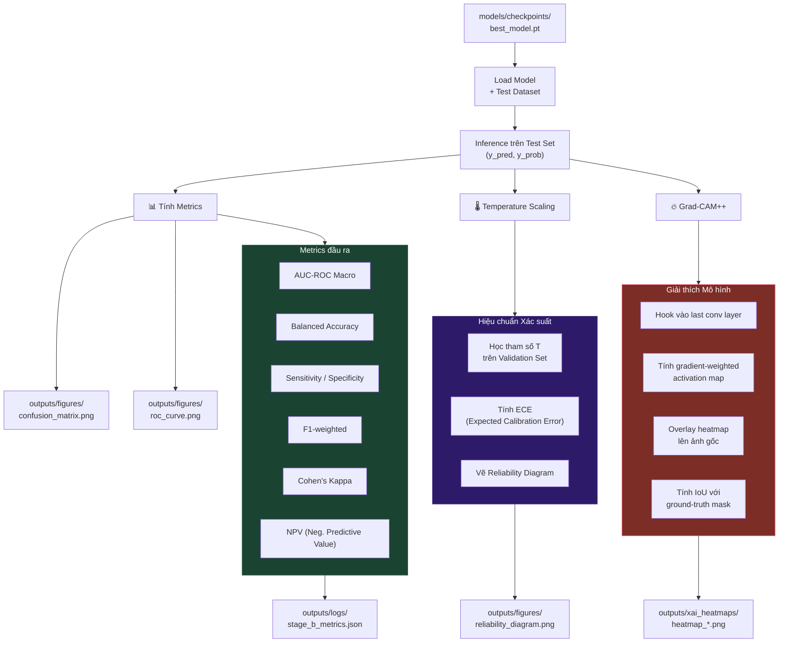
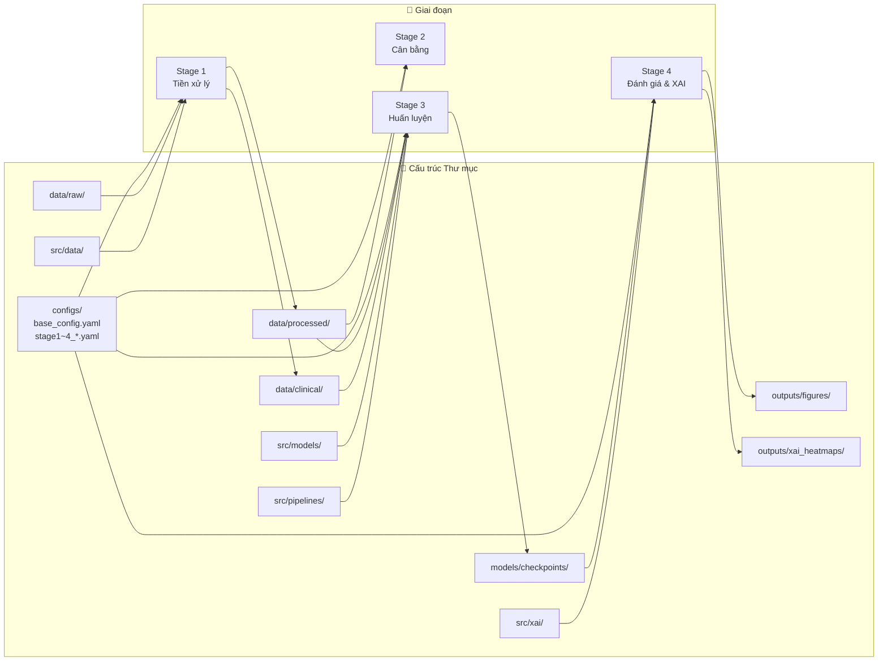

# 🩺 DermaSense AI — Sơ đồ Tổng quan Hệ thống

---

## 1. Tổng quan Pipeline — 4 Giai đoạn chính

Hệ thống DermaSense AI hoạt động theo **4 giai đoạn tuần tự**, từ dữ liệu thô đến kết quả chẩn đoán có giải thích.

> **Giải thích:** Hệ thống được chia thành 4 giai đoạn rõ ràng. Mỗi giai đoạn có file cấu hình YAML riêng (`configs/stageX_*.yaml`), script chạy riêng (`src/pipelines/run_stageX_*.py`), và output riêng. Điều này đảm bảo tính **reproducibility** (lặp lại được) và dễ dàng debug từng bước.

---

## 2. Luồng Tiền xử lý Dữ liệu (Stage 1) — Chi tiết

> **Giải thích từng bước:**
> - **Laplacian Variance:** Phát hiện ảnh bị mờ (chất lượng kém) bằng cách tính phương sai của đạo hàm bậc 2 Laplacian. Ảnh mờ sẽ bị gắn cờ hoặc loại ra.
> - **DullRazor:** Thuật toán chuyên dụng cho ảnh da liễu — phát hiện và xóa lông trên da bằng phép toán hình thái học (morphological blackhat) kết hợp inpainting.
> - **Gray World:** Cân bằng trắng để các ảnh chụp từ các thiết bị/ánh sáng khác nhau có tông màu nhất quán.
> - **Resize + Normalize:** Đưa tất cả ảnh về kích thước 384×384 (input chuẩn của EfficientNetV2) và chuẩn hóa theo thống kê ImageNet.

---

## 3. Kiến trúc Mô hình — 2 Stage Multimodal

> **Giải thích kiến trúc 2 tầng:**
> - **Stage A (Safety Screener):** Bộ sàng lọc nhị phân — nhanh chóng phân loại ảnh thành "Cần chú ý" (melanoma, BCC, AK) vs "Lành tính". Yêu cầu **Sensitivity ≥ 95%** để không bỏ sót ca nguy hiểm. Kết hợp đặc trưng ABCDE (Bất đối xứng, Đường biên, Màu sắc, Đường kính, Tiến triển) với ảnh.
> - **Stage B (Multimodal Classifier):** Chỉ chạy với các ca "Cần chú ý" → phân loại chi tiết thành 7 loại bệnh. Kết hợp **Vision Branch** (EfficientNetV2-M trích xuất đặc trưng ảnh) với **Clinical Branch** (MLP xử lý metadata lâm sàng như tuổi, giới tính, vị trí tổn thương) thông qua **Fusion Layer**.

---

## 4. Chiến lược Huấn luyện (Stage 3) — Chi tiết

> **Giải thích chiến lược 2-step training:**
> - **Step 1 (Freeze):** Đóng băng backbone EfficientNetV2 (đã pretrained trên ImageNet), chỉ huấn luyện lớp Fusion và Classifier. Mục đích: để các lớp mới học được cách "đọc" feature từ backbone mà không làm hỏng weights đã học.
> - **Step 2 (Fine-tune):** Mở khóa toàn bộ mạng, huấn luyện end-to-end với learning rate rất nhỏ. Cosine Annealing giảm LR mượt mà, Early Stopping ngăn overfitting.
> - **Focal Loss:** Giải quyết mất cân bằng dữ liệu — các lớp hiếm (MEL, DF) được tăng trọng số, lớp phổ biến (NV) bị giảm trọng số.

---

## 5. Luồng Đánh giá & Explainable AI (Stage 4)

> **Giải thích từng thành phần:**
> - **Metrics:** Đánh giá toàn diện mô hình — AUC-ROC cho khả năng phân biệt, Sensitivity cho độ nhạy phát hiện bệnh nguy hiểm, NPV cho tỷ lệ "âm tính thật" (rất quan trọng trong y khoa).
> - **Temperature Scaling:** Hiệu chuẩn xác suất đầu ra để mô hình "tự tin đúng mức" — nếu mô hình nói 80% là melanoma thì thực tế phải đúng ~80% (ECE < 0.05).
> - **Grad-CAM++:** Tạo heatmap hiển thị vùng ảnh nào mô hình "nhìn vào" khi đưa ra quyết định — giúp bác sĩ tin tưởng và kiểm chứng kết quả AI.

---

## 6. Mapping Thư mục ↔ Giai đoạn

---

## 7. Lệnh chạy từng Giai đoạn

| Giai đoạn | Lệnh CLI | Mục đích |
|---|---|---|
| **Setup** | `python check_gpu.py` | Kiểm tra môi trường, GPU, dependencies |
| **Stage 1** | `python -m src.pipelines.run_stage1_preprocess` | Tiền xử lý toàn bộ ảnh thô → ảnh sạch |
| **Stage 3** | `python -m src.pipelines.run_stage3_train` | Huấn luyện mô hình (Stage A + B) |
| **Stage 4** | `python -m src.pipelines.run_stage4_eval_xai` | Đánh giá metric + xuất heatmap Grad-CAM++ |
| **Export** | `python -m src.pipelines.run_export_onnx` | Chuyển đổi sang ONNX để deploy |
| **Test** | `pytest tests/ -v` | Chạy unit tests kiểm tra code |
| **DVC** | `dvc repro` | Chạy lại toàn bộ pipeline tự động (reproducible) |

---

> [!TIP]
> Khi chạy trên **Kaggle Notebooks**, bạn chỉ cần upload thư mục `src/` và `configs/` lên, mount dataset ISIC 2019, rồi chạy các lệnh trên. GPU T4 miễn phí đủ để train trong ~2-4 giờ.
